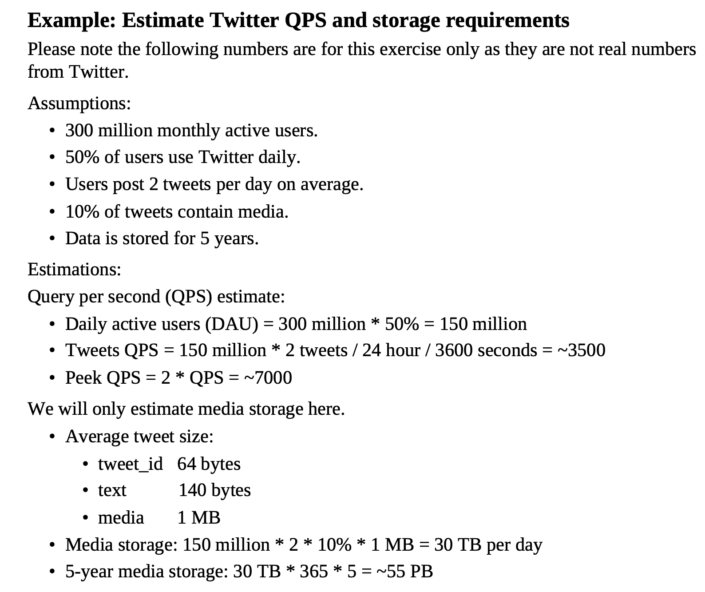

# Back of Envelope Examples

Back of envelope examples are quick, rough calculations used to estimate the feasibility or scale of a project. They help in
making decisions without needing detailed analysis. Here are some common examples:
1. **Estimating User Load**:
   - If you expect 10,000 users and each user makes 5 requests per minute, that's 50,000 requests per minute.
   - Convert to requests per second: 50,000 / 60 ≈ 833 requests/second.
2. **Data Storage Requirements**:
   - If each user generates 1MB of data per month, for 10,000 users, that's 10,000 MB or 10 GB per month.
   - Over a year, this would be 120 GB.
3. **Bandwidth Estimation**:
   - If each request is 100KB and you have 833 requests/second, the bandwidth needed is 833 * 100KB = 83,300 KB/s or about 83.3 MB/s.
4. **Server Capacity**:
   - If one server can handle 200 requests/second, and you need to handle 833 requests/second, you would need at least 5 servers (833 / 200 = 4.165, round up to 5).
5. **Cost Estimation**:
   - If each server costs $100/month, for 5 servers, the monthly cost would be 5 * $100 = $500/month.
6. **Latency Considerations**:
   - If the average latency per request is 200ms, and you have 833 requests/second, the total latency impact on the system can be significant. You might need to optimize to reduce this.
7. **Database Size**:
   - If each record is 1KB and you expect to store 1 million records, the database size would be approximately 1GB.
8. **Scaling Needs**:
   - If you expect traffic to double every year, plan for scaling your infrastructure accordingly. For example, if you start with 5 servers, you might need 10 servers next year.
These rough calculations help in making quick decisions about architecture, infrastructure, and budgeting without diving into complex details.      